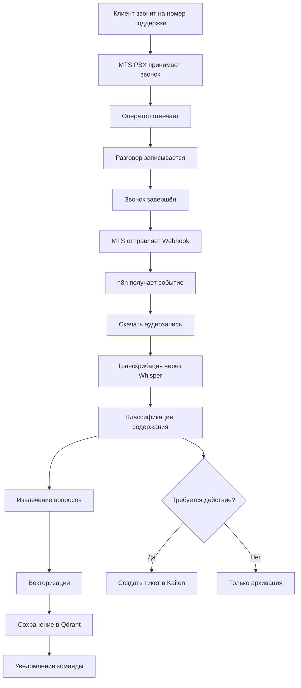
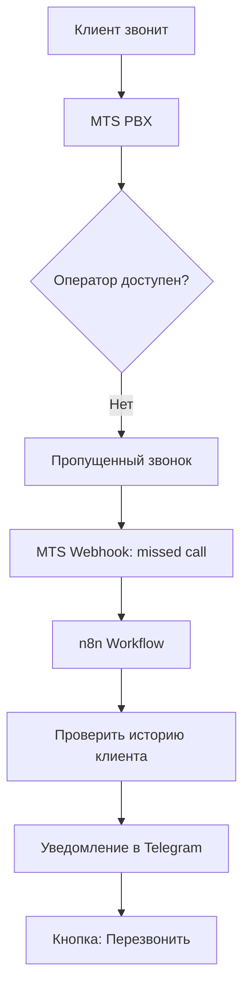
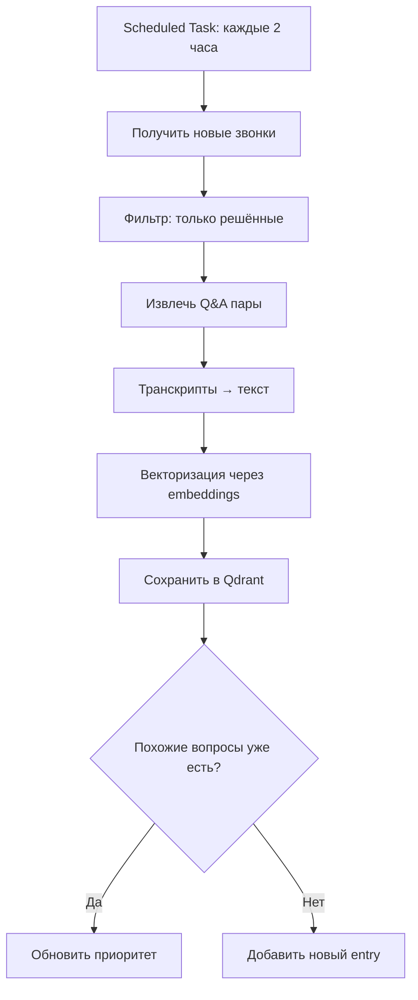

# 📞 Интеграция с АТС МТС

## Обзор

Интеграция Dialog Keeper с цифровой АТС МТС позволяет автоматически обрабатывать телефонные звонки единого номера технической поддержки, транскрибировать их, сопоставлять с вопросами и сохранять в векторизованной базе знаний.

---

## Возможности

### ✅ Что даёт интеграция

1. **Автоматическая транскрипция звонков**  
   Все входящие и исходящие звонки автоматически преобразуются в текст

2. **Единая база знаний**  
   Транскрипты звонков векторизуются и становятся доступными для RAG-системы

3. **Сопоставление с контекстом**  
   Звонки связываются с клиентами, проектами и историей обращений

4. **Автоматическое создание тикетов**  
   При выявлении новых проблем автоматически создаются тикеты в Kaiten

5. **Real-time уведомления**  
   Команда получает уведомления о важных и пропущенных звонках

6. **Аналитика**  
   Статистика звонков, выявление повторяющихся проблем, топ вопросов

---

## Архитектура интеграции

```
┌─────────────────────────────────────────────────────────────┐
│                    КЛИЕНТ ЗВОНИТ                            │
│              на единый номер техподдержки                    │
└────────────────────────┬────────────────────────────────────┘
                         │
                         ▼
              ┌──────────────────────┐
              │   MTS Digital PBX    │
              │   (Цифровая АТС)     │
              └──────────┬───────────┘
                         │
                         ├─────────────────┐
                         │                 │
                         ▼                 ▼
              ┌──────────────────┐  ┌─────────────┐
              │  Call Recording  │  │  Webhook    │
              │  (Аудиозапись)   │  │  Events     │
              └──────────┬───────┘  └──────┬──────┘
                         │                  │
                         └─────────┬────────┘
                                   │
                                   ▼
                        ┌──────────────────┐
                        │   n8n Workflow   │
                        │   или API Client │
                        └──────────┬───────┘
                                   │
                   ┌───────────────┼───────────────┐
                   │               │               │
                   ▼               ▼               ▼
         ┌─────────────┐  ┌──────────────┐  ┌──────────┐
         │   Whisper   │  │  Metadata    │  │   Team   │
         │     API     │  │  Storage     │  │  Alert   │
         │(Transcribe) │  │(PostgreSQL)  │  │(Telegram)│
         └──────┬──────┘  └──────────────┘  └──────────┘
                │
                ▼
         ┌─────────────────┐
         │  AI Classifier  │
         │  (Intent/Topic) │
         └──────┬──────────┘
                │
                ▼
         ┌─────────────────┐
         │  Vectorization  │
         │  (Embeddings)   │
         └──────┬──────────┘
                │
                ▼
         ┌─────────────────┐
         │  Qdrant Store   │
         │ (Knowledge Base)│
         └─────────────────┘
```

---

## Workflow интеграции

### 1. Входящий звонок



### 2. Пропущенный звонок



### 3. Синхронизация в базу знаний



---

## Технические детали

### MTS Digital PBX API

#### Endpoints

**1. Получение списка звонков**
```http
GET https://api.mts.ru/pbx/v1/calls
Authorization: Bearer {TOKEN}
```

**Query параметры:**
- `date_from` - начальная дата (ISO 8601)
- `date_to` - конечная дата
- `direction` - направление: `inbound`, `outbound`, `all`
- `status` - статус: `answered`, `missed`, `busy`, `all`
- `limit` - количество записей (по умолчанию 100)

**Response:**
```json
{
  "calls": [
    {
      "id": "call_123456",
      "phone_number": "+79161234567",
      "direction": "inbound",
      "status": "answered",
      "duration": 125,
      "started_at": "2026-01-08T10:30:00Z",
      "ended_at": "2026-01-08T10:32:05Z",
      "recording_url": "https://api.mts.ru/pbx/v1/recordings/rec_123456",
      "transcript_url": "https://api.mts.ru/pbx/v1/transcripts/trans_123456"
    }
  ],
  "total": 42,
  "page": 1
}
```

**2. Получение записи звонка**
```http
GET https://api.mts.ru/pbx/v1/recordings/{recording_id}
Authorization: Bearer {TOKEN}
```

**Response:**
- Content-Type: `audio/wav` или `audio/mp3`
- Бинарный аудиофайл

**3. Получение транскрипта (если доступен)**
```http
GET https://api.mts.ru/pbx/v1/transcripts/{transcript_id}
Authorization: Bearer {TOKEN}
```

**Response:**
```json
{
  "transcript_id": "trans_123456",
  "call_id": "call_123456",
  "language": "ru",
  "text": "Здравствуйте, у меня проблема с подключением к API...",
  "confidence": 0.95,
  "words": [
    {
      "word": "Здравствуйте",
      "start_time": 0.5,
      "end_time": 1.2,
      "confidence": 0.98
    }
  ]
}
```

**4. Webhook уведомления**

MTS отправляет webhook на настроенный URL при событиях:
- Новый звонок
- Звонок завершён
- Пропущенный звонок

```http
POST https://your-domain.com/api/webhooks/mts-pbx
Content-Type: application/json
X-MTS-Signature: {HMAC_SHA256}

{
  "event": "call.ended",
  "call_id": "call_123456",
  "phone_number": "+79161234567",
  "direction": "inbound",
  "status": "answered",
  "duration": 125,
  "timestamp": "2026-01-08T10:32:05Z"
}
```

---

## Реализация

### 1. n8n Workflow: Обработка звонка

**Trigger:** Webhook (от MTS)

**Nodes:**

```yaml
1. Webhook Trigger
   - URL: /webhooks/mts-call
   - Method: POST
   - Authentication: HMAC signature verification

2. Filter: Call Ended
   - Condition: event == "call.ended"
   - Пропускать только завершённые звонки

3. HTTP Request: Get Call Metadata
   - URL: https://api.mts.ru/pbx/v1/calls/{{$json.call_id}}
   - Method: GET
   - Authentication: Bearer Token

4. HTTP Request: Download Recording
   - URL: {{$json.recording_url}}
   - Method: GET
   - Response Type: Binary

5. OpenAI Whisper: Transcribe
   - Model: whisper-1
   - Language: ru
   - Input: Binary audio file

6. Set Variables: Prepare Context
   - Variables:
       - call_id
       - phone_number
       - transcript
       - duration
       - timestamp

7. OpenAI GPT: Classify & Extract
   - Prompt: "Классифицируй содержание звонка. Извлеки вопросы и проблемы клиента."
   - Model: gpt-4o-mini
   - Output: JSON

8. PostgreSQL: Save Call
   - Table: calls
   - Fields: call_id, phone_number, transcript, metadata, classification

9. Python Code: Generate Embeddings
   - Input: transcript
   - Model: text-embedding-3-small
   - Output: vector[1536]

10. HTTP Request: Save to Qdrant
    - URL: http://qdrant:6333/collections/calls/points
    - Method: PUT
    - Body: {vector, metadata}

11. Switch: Check if Action Required
    - If classification.intent == "issue" → Create Ticket
    - Else → Skip

12. HTTP Request: Create Kaiten Ticket (conditional)
    - URL: https://api.kaiten.ru/v1/cards
    - Method: POST
    - Body: ticket data

13. Telegram: Notify Team
    - Chat: Internal Team Channel
    - Message: "📞 Новый звонок от {{phone_number}}\nТема: {{classification.topic}}\nДлительность: {{duration}}с"
    - Button: "Открыть транскрипт"
```

### 2. Python Service: Call Processor

Альтернативно можно реализовать через Python сервис:

```python
# src/integrations/mts_pbx.py

import requests
from openai import OpenAI
from qdrant_client import QdrantClient

class MTSPBXClient:
    def __init__(self, api_token: str, base_url: str):
        self.token = api_token
        self.base_url = base_url
        self.headers = {"Authorization": f"Bearer {self.token}"}
        self.openai = OpenAI()
        self.qdrant = QdrantClient(url="http://qdrant:6333")
    
    def get_calls(self, date_from: str, date_to: str) -> list:
        """Получить список звонков"""
        response = requests.get(
            f"{self.base_url}/calls",
            headers=self.headers,
            params={"date_from": date_from, "date_to": date_to}
        )
        return response.json()["calls"]
    
    def download_recording(self, recording_url: str) -> bytes:
        """Скачать аудиозапись"""
        response = requests.get(recording_url, headers=self.headers)
        return response.content
    
    def transcribe_call(self, audio_data: bytes) -> str:
        """Транскрибировать звонок через Whisper"""
        response = self.openai.audio.transcriptions.create(
            model="whisper-1",
            file=("audio.wav", audio_data),
            language="ru"
        )
        return response.text
    
    def classify_call(self, transcript: str) -> dict:
        """Классифицировать содержание звонка"""
        prompt = f"""
        Проанализируй транскрипт звонка и извлеки:
        1. Тип звонка (question, issue, request, info)
        2. Основную тему
        3. Ключевые вопросы клиента
        4. Нужно ли создавать тикет? (да/нет)
        
        Транскрипт:
        {transcript}
        
        Ответь в JSON формате.
        """
        
        response = self.openai.chat.completions.create(
            model="gpt-4o-mini",
            messages=[{"role": "user", "content": prompt}],
            response_format={"type": "json_object"}
        )
        
        return response.choices[0].message.content
    
    def vectorize_and_store(self, transcript: str, metadata: dict):
        """Векторизовать и сохранить в Qdrant"""
        # Generate embedding
        embedding_response = self.openai.embeddings.create(
            model="text-embedding-3-small",
            input=transcript
        )
        vector = embedding_response.data[0].embedding
        
        # Store in Qdrant
        self.qdrant.upsert(
            collection_name="calls",
            points=[{
                "id": metadata["call_id"],
                "vector": vector,
                "payload": {
                    "transcript": transcript,
                    "phone_number": metadata["phone_number"],
                    "timestamp": metadata["timestamp"],
                    "classification": metadata["classification"]
                }
            }]
        )
    
    def process_call(self, call_id: str):
        """Полный цикл обработки звонка"""
        # 1. Get call metadata
        call_data = self.get_calls(...)  # filter by call_id
        
        # 2. Download recording
        audio = self.download_recording(call_data["recording_url"])
        
        # 3. Transcribe
        transcript = self.transcribe_call(audio)
        
        # 4. Classify
        classification = self.classify_call(transcript)
        
        # 5. Store in DB
        # ... PostgreSQL insert ...
        
        # 6. Vectorize and store in Qdrant
        self.vectorize_and_store(transcript, {
            "call_id": call_id,
            "phone_number": call_data["phone_number"],
            "timestamp": call_data["timestamp"],
            "classification": classification
        })
        
        # 7. Create ticket if needed
        if classification.get("create_ticket"):
            self.create_kaiten_ticket(...)
        
        # 8. Notify team
        self.notify_team(...)
```

### 3. Webhook Handler

```python
# src/api/webhooks.py

from fastapi import APIRouter, Request, HTTPException
import hmac
import hashlib

router = APIRouter()

def verify_mts_signature(payload: bytes, signature: str, secret: str) -> bool:
    """Проверка HMAC подписи от MTS"""
    expected = hmac.new(
        secret.encode(),
        payload,
        hashlib.sha256
    ).hexdigest()
    return hmac.compare_digest(expected, signature)

@router.post("/webhooks/mts-pbx")
async def mts_pbx_webhook(request: Request):
    """Обработка webhook от MTS PBX"""
    # Verify signature
    signature = request.headers.get("X-MTS-Signature")
    payload = await request.body()
    
    if not verify_mts_signature(payload, signature, settings.MTS_WEBHOOK_SECRET):
        raise HTTPException(status_code=401, detail="Invalid signature")
    
    # Parse event
    data = await request.json()
    event = data.get("event")
    
    if event == "call.ended":
        # Запустить обработку звонка асинхронно (через Celery)
        process_call_task.delay(data["call_id"])
    
    elif event == "call.missed":
        # Уведомить команду о пропущенном звонке
        notify_missed_call.delay(data["phone_number"])
    
    return {"status": "ok"}
```

---

## База данных

### Таблица calls

```sql
CREATE TABLE calls (
    id SERIAL PRIMARY KEY,
    call_id VARCHAR(255) UNIQUE NOT NULL,
    phone_number VARCHAR(50) NOT NULL,
    direction VARCHAR(20) NOT NULL, -- inbound/outbound
    status VARCHAR(20) NOT NULL, -- answered/missed/busy
    duration INTEGER, -- seconds
    started_at TIMESTAMP NOT NULL,
    ended_at TIMESTAMP,
    recording_url TEXT,
    transcript TEXT,
    transcript_confidence FLOAT,
    classification JSONB,
    customer_id INTEGER REFERENCES customers(id),
    ticket_id INTEGER REFERENCES kaiten_tickets(id),
    vector_id UUID, -- ID в Qdrant
    created_at TIMESTAMP DEFAULT NOW(),
    updated_at TIMESTAMP DEFAULT NOW()
);

CREATE INDEX idx_calls_phone_number ON calls(phone_number);
CREATE INDEX idx_calls_started_at ON calls(started_at);
CREATE INDEX idx_calls_customer_id ON calls(customer_id);
```

---

## Аналитика

### Метрики

1. **Количество звонков**
   - Входящие/исходящие
   - Отвеченные/пропущенные
   - Средняя длительность

2. **Топ вопросов**
   - Кластеризация транскриптов
   - Выявление повторяющихся тем

3. **Quality Score**
   - Confidence транскрипции
   - Полнота ответов оператора

4. **Conversion to Tickets**
   - Сколько звонков привели к созданию тикетов
   - Время решения

### Dashboard (Grafana)

```yaml
Metrics:
  - calls_total{direction="inbound|outbound", status="answered|missed"}
  - calls_duration_seconds_avg
  - transcription_confidence_avg
  - tickets_created_from_calls_total
  - top_call_topics
```

---

## Безопасность

### 1. Аутентификация
- Bearer Token для MTS API (хранить в `.env` или Vault)
- HMAC подпись для webhook (проверять при получении)

### 2. Шифрование
- Транскрипты содержат персональные данные → шифровать в БД
- TLS/SSL для всех API вызовов

### 3. GDPR/Закон о персональных данных
- Хранить записи звонков не дольше необходимого (например, 90 дней)
- Возможность удалить данные по запросу клиента
- Логировать доступ к записям

---

## Стоимость

### MTS Digital PBX
- **Базовая стоимость:** от ₽3000/месяц (зависит от тарифа)
- **Минуты звонков:** ₽1-3 за минуту (входящие обычно бесплатны)
- **Хранение записей:** ₽500-1000/месяц за 10GB

### OpenAI Whisper
- **Транскрипция:** $0.006 за минуту
- **Пример:** 100 звонков/день × 3 мин = 300 мин/день = $1.8/день ≈ $54/месяц

### Embeddings
- **text-embedding-3-small:** $0.00002 за 1K tokens
- **Пример:** 100 транскриптов/день × 500 tokens = 50K tokens/день ≈ $1/день ≈ $30/месяц

**Итого:** ~₽3000-10000 + $84/месяц

---

## Roadmap

### Phase 1 (MVP)
- ✅ Webhook endpoint
- ✅ Скачивание записей
- ✅ Транскрипция через Whisper
- ✅ Сохранение в БД
- ✅ Уведомления команды

### Phase 2
- ✅ Векторизация и Qdrant
- ✅ Классификация содержания
- ✅ Автоматическое создание тикетов
- ✅ Сопоставление с клиентами

### Phase 3
- 📊 Аналитика и дашборды
- 🎯 Sentiment analysis (анализ эмоций)
- 🤖 AI-ассистент для оператора (real-time подсказки)
- 📞 Автоматизированные ответы (IVR интеграция)

---

## Примеры использования

### Пример 1: Клиент звонит с вопросом

**Сценарий:**
1. Клиент звонит: "У меня не работает API, получаю ошибку 403"
2. Оператор отвечает: "Проверьте, пожалуйста, ваш API ключ..."
3. Звонок завершается
4. **Автоматически:**
   - Транскрипт сохраняется
   - Векторизуется и попадает в базу знаний
   - В следующий раз AI-бот в Telegram сможет ответить на похожий вопрос

### Пример 2: Пропущенный звонок

**Сценарий:**
1. Клиент звонит в 02:00 ночи (нерабочее время)
2. Звонок не отвечен
3. **Автоматически:**
   - Уведомление в Telegram команде
   - "📞 Пропущенный звонок от +7916XXXXXX в 02:00"
   - История клиента (если есть)
   - Кнопка "Перезвонить"

### Пример 3: Повторяющаяся проблема

**Сценарий:**
1. За неделю 15 клиентов звонят с одинаковым вопросом
2. **Аналитика выявляет:**
   - Топ вопрос: "Как настроить webhook?"
   - Рекомендация: Добавить в FAQ, улучшить документацию

---

## FAQ

### Q: Что если MTS API недоступен?
**A:** Система продолжает работать без интеграции звонков. Критических зависимостей нет. Можно настроить fallback: webhook retry logic или scheduled pull вместо real-time.

### Q: Как быть с конфиденциальностью?
**A:** Транскрипты шифруются в БД. Доступ только авторизованным сотрудникам. Автоматическое удаление через N дней.

### Q: Можно ли интегрировать другую АТС?
**A:** Да, архитектура абстрактная. Можно добавить адаптеры для Zadarma, Мегафон, Asterisk и т.д.

---

**Версия:** 1.0  
**Дата:** 2026-01-08  
**Автор:** Dialog Keeper Team  
**Компания:** РИПАС

